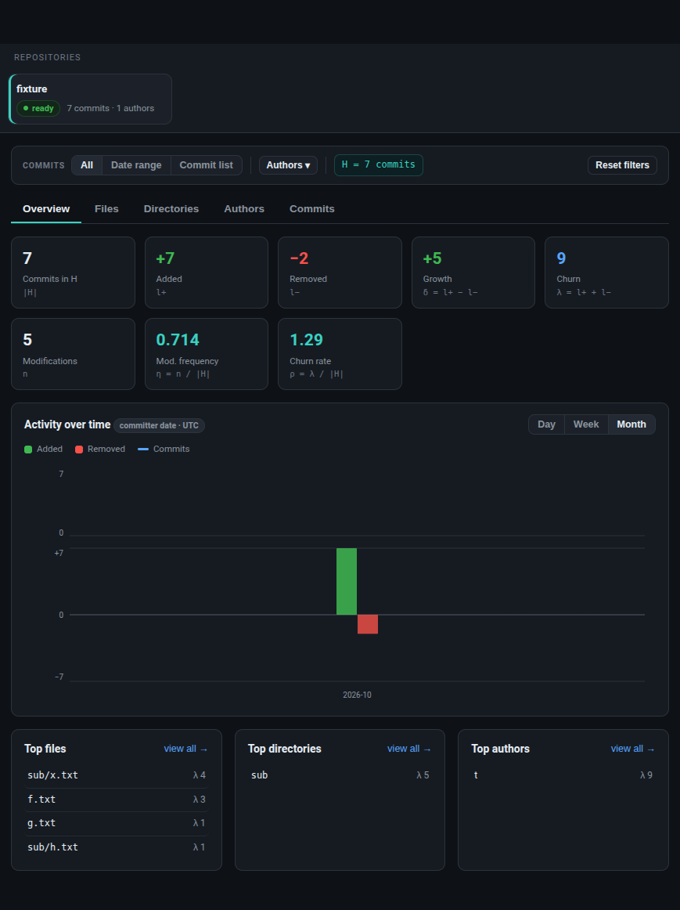
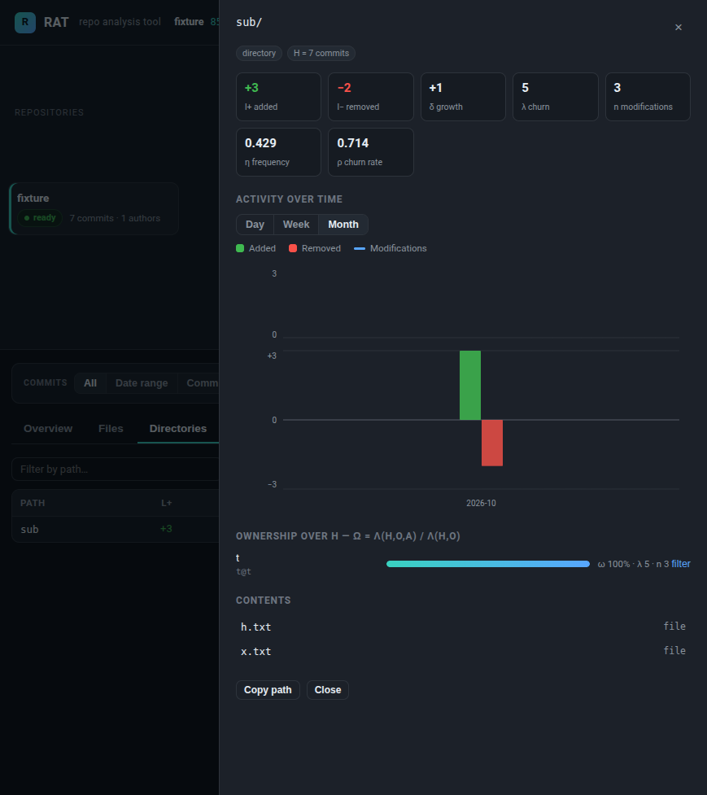

# RAT — Repo Analysis Tool

A web dashboard that analyses the evolution of Git repositories. Point it at a
repository (URL or zip archive), and it reports line-level metrics for the
repository, every directory and every file — filtered by time range, manual
commit list or author — over any commit set.



## Quick start

```sh
git clone https://github.com/Tyron-Van-Tonder/SDP-Test.git
cd SDP-Test
python3 -m venv .venv
.venv/bin/pip install -r requirements.txt      # Windows: .venv\Scripts\pip
.venv/bin/uvicorn app:app --port 8000          # or: .venv/bin/python app.py
```

Then open <http://127.0.0.1:8000> and click **Add repository**.

* **From a URL** — any public clone URL (`https://`, `ssh://`, `git@`, `git://`).
  The repository is deep-cloned, so the full history is available.
* **From a zip** — an archive of a working tree **including its `.git`
  directory** (e.g. `zip -r repo.zip repo/`).

Ingestion runs in the background with live progress; once a repository is
`ready`, every view in the dashboard answers instantly.

Requirements: Python ≥ 3.10 and the `git` command-line tool on `PATH`.
The only third-party Python dependencies are FastAPI, Uvicorn and
`python-multipart` (see `requirements.txt`). The frontend is plain
HTML/CSS/JavaScript with **no build step and no external/CDN requests**, so the
tool works fully offline.

## Metrics

All metrics are computed over a **commit set** `H`:

* `H` = all non-merge commits that are reachable from the analysed reference
  `h_r` (default `HEAD`; any branch, tag or commit hash can be requested).
* `H_t` = `{ h ∈ H : t ≤ cdate(h) }` — commits not older than `t`
  (committer dates, UTC).
* `H_{i,j}` = `{ h ∈ H : i ≤ cdate(h) < j }`.
* `H` can also be given as a **manual commit list** (full or abbreviated
  hashes). Unknown entries are reported in the UI.

Per object `o` (file, directory or the repository itself):

| Symbol | Name | Definition |
|---|---|---|
| `l+` | added | sum of added lines over `H` |
| `l−` | removed | sum of removed lines over `H` |
| `δ` | growth | `l+ − l−` |
| `λ` | churn | `l+ + l−` |
| `n` | modifications | number of commits in `H` with `λ > 0` |
| `η` | modification frequency | `n / |H|` (0 if `|H| = 0`) |
| `ρ` | change rate | `λ / |H|` (0 if `|H| = 0`) |
| `ω` | ownership | `λ(H,o,a) / λ(H,o)` per author `a` |

Directory metrics are recursive rollups of the subtree below them — the
repository is the root directory — so a directory's numbers always equal the
sum of its contents' numbers.

Per the specification, **merge commits are not counted**, **binary files are
not line-counted** (they still appear, marked as binary, and count as objects),
and **renames are detected at ≥ 50 % similarity** (`git log -M50%`). A pure
rename contributes zero lines; a rename combined with edits is attributed to
the new path (the old path is recorded). The initial commit is diffed against
an empty tree.

## Filters

* **Commits** — all, a committer-date range `[from, to)` (`H_{i,j}`), or a
  manual list of commit hashes (abbreviations down to 4 hex characters are
  accepted, like `git rev-parse`; unmatched entries are flagged).
* **Authors** — multi-select; metrics are restricted to the chosen authors.
  A per-object **ownership** breakdown (`ω`) is shown in the object inspector.

Identity resolution happens in two layers: `.mailmap` (applied from the
analysed reference) and **manual merges** in the Authors tab (fold any number
of identities into one; reversible with *unmerge*). Merges propagate to every
metric and to ownership shares immediately.

## How it works

```
            ┌─────────────┐   clone / unzip   ┌──────────────────────┐
  URL/zip ──▶  ingestion   ─────────────────▶  git log --numstat -z │
            │   worker    │   (1 thread)      │  --use-mailmap -M50% │
            └──────┬──────┘                   └──────────┬───────────┘
                   │  one streaming pass                 │
                   ▼                                     ▼
            ┌──────────────────────────────────────────────────────┐
            │  SQLite (WAL) — commits, changes, per-commit dir     │
            │  rollups, object universe, author identities         │
            └──────────────────────────┬───────────────────────────┘
                                       │ indexed aggregation queries
                                       ▼
            ┌──────────────────────────────────────────────────────┐
            │  FastAPI  ── JSON API ──▶  dependency-free SPA       │
            └──────────────────────────────────────────────────────┘
```

* **One streaming pass.** `git log --numstat -z -M50% --use-mailmap` is parsed
  as a NUL-delimited token stream; nothing is buffered in memory beyond one
  batch, so very large histories (git.git: ~90 k commits) ingest in one go.
* **Precomputed rollups.** During the same pass, each commit's changes are
  aggregated into per-directory rows, so directory metrics and time series are
  plain indexed `SUM()`s at query time.
* **Single writer.** Ingestion runs in one background worker thread sharing a
  single SQLite connection; the API only reads (small writes: repo rows,
  author merges). WAL mode + a 30 s busy timeout keep concurrent reads fast.
* **Serial ingest queue.** Multiple repositories can be added back-to-back;
  they are analysed one at a time with live per-repo progress reporting.
* **Indices are dropped** during the bulk load and recreated at the end, which
  is markedly faster than insert-with-index on large histories.

## API

The SPA is a thin client over a JSON API (interactive docs at `/docs`):

| Method | Path | Purpose |
|---|---|---|
| `GET` | `/api/repos` | list repositories + ingest queue depth |
| `POST` | `/api/repos` | ingest from URL (`{"url", "name?", "ref?"}`) |
| `POST` | `/api/repos/upload` | ingest from a zip upload (multipart) |
| `GET` | `/api/repos/{id}` | repository detail + overview |
| `DELETE` | `/api/repos/{id}` | delete a repository and its data |
| `GET` | `/api/repos/{id}/metrics` | `kind=repo\|file\|dir` metric table |
| `GET` | `/api/repos/{id}/series` | binned commit/churn time series |
| `GET` | `/api/repos/{id}/object` | one object + per-author ownership |
| `GET` | `/api/repos/{id}/authors` | identity overview (merged view) |
| `POST` | `/api/repos/{id}/authors/merge` | fold an identity into another |
| `POST` | `/api/repos/{id}/authors/unmerge` | undo a manual merge |
| `GET` | `/api/repos/{id}/commits` | paged/searched commit browser |
| `GET` | `/api/repos/{id}/objects` | object-universe browsing/search |

Every metric endpoint accepts the shared filter parameters:
`mode=all|range|list`, `start`/`end` (epoch seconds), `hashes`, `authors`
(comma-separated ids).

## Dashboard

* **Overview** — the eight repository-level statistics as cards, a
  day/week/month activity chart (added vs removed lines + commit line),
  and top files / directories / authors with one-click drill-down.
* **Files / Directories** — sortable, searchable metric tables with CSV
  export; optionally include objects untouched in the current range.
* **Authors** — the identity table with commits, added, removed, churn,
  modifications, modification frequency and churn rate;
  expandable member lists, merge controls and filter-by-author.
* **Commits** — paged history with search; select commits and *apply* them as
  the manual commit-list filter.
* **Object inspector** (drawer) — any file or directory: all seven metrics,
  its own time series, per-author ownership bars, and a lazy browser of
  its contents.



## Tests

Self-contained tests (they build small throwaway Git repositories in a temp
directory and exercise the parser + metric engine end-to-end):

```sh
.venv/bin/python -m unittest discover -s tests -v
```

## Project layout

```
app.py          FastAPI application: ingestion queue + JSON API + static mount
ingest.py       clone/zip → git log stream parser → SQLite bulk load
metrics.py      metric engine: filters, rollups, series, ownership, paging
db.py           SQLite schema + connection helpers
static/         dashboard (index.html, app.js, charts.js, style.css)
tests/          unittest suite (parser + metrics integration)
data/           runtime store for ingested repositories (gitignored)
```

## Design notes

* **Precompute over scan-at-request.** A dashboard that scans history per
  click cannot stay interactive on 100 k-commit repositories; one careful pass
  at ingest time makes every subsequent query an indexed aggregation.
* **Line metrics from `--numstat -z`** — the same numbers `git log --numstat`
  prints, parsed from its NUL-delimited machine format (rename markers,
  binary entries and the leading newline quirk handled explicitly).
* **Custom SVG charts.** The chart renderer is a small dependency-free
  component (mirrored bars + optional line series, tooltips, resize) so the
  dashboard has zero external requests and nothing to build.
* **Recursive rollups stored per commit** make directory metrics exact
  (each commit counted once per directory) without N× subtree scans.

## AI declaration

This repository makes use of AI code generation using the following tools: Qoder[Ultimate].
This repository makes use of AI in-line editing using the following tools: Qoder[Ultimate].
This repository does not use AI code review.

The preceding document was generated and edited with the assistance of: Qoder[Ultimate].
